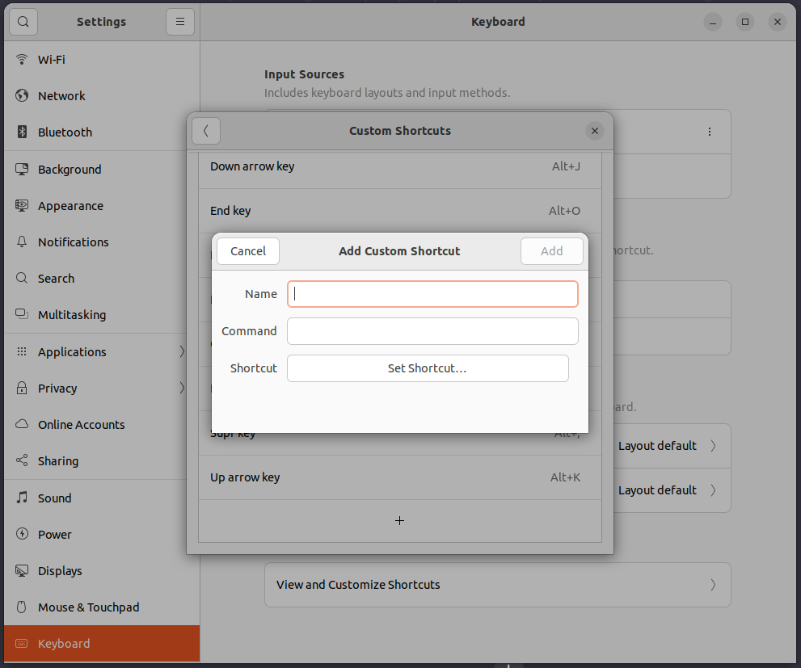

# Ubuntu Keyboard Shortcuts

## About

There are many ways to customize your Ubuntu experience. This is the easiest way to do it in Ubuntu 20.04 LTS, using only the built-in keyboard shortcut settings.

## Instructions :memo:

1. Open the Ubuntu **Settings**.
2. Navigate to the **Keyboard tab**.
3. Select **View and Customize Shortcuts**.
4. Select **Custom Shortcuts**.
5. Click the **+** button to add a new shortcut.

## Keyboard Shortcuts :keyboard:

| Shortcut | Command | Description                |
| -------- | ------- | -------------------------- |
| `Alt`+`M`  | `xdotool key --clearmodifiers BackSpace` | Delete backspace key |
| `Alt`+`,`  | `xdotool key --clearmodifiers Delete` | Delete key |
| `Alt`+`J`  | `xdotool key --clearmodifiers Down` | Down arrow key |
| `Alt`+`K`  | `xdotool key --clearmodifiers Up` | Up arrow key |
| `Alt`+`L`  | `xdotool key --clearmodifiers Right` | Right arrow key |
| `Alt`+`H`  | `xdotool key --clearmodifiers Left` | Left arrow key |
| `Alt`+`I`  | `xdotool key --clearmodifiers Home` | Home key |
| `Alt`+`O`  | `xdotool key --clearmodifiers End` | End key |
| `Alt`+`T`  | `https://web.whatsapp.com/` | Open Whatsapp Web |
